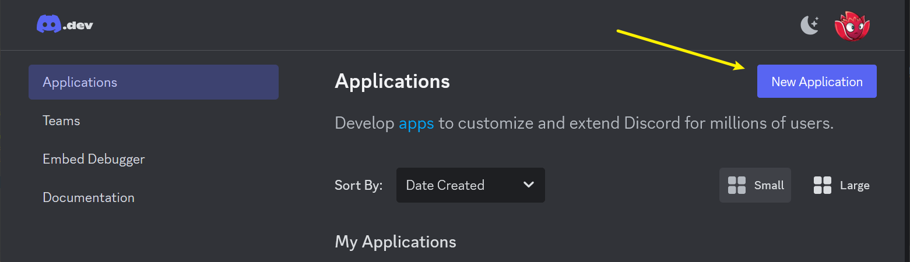

# 配置DiscordBot

***

Musicatri是一个Discord机器人项目，因此部署项目之前，您应确保已经创建了一个可用的机器人应用，以及，您需要一定的服务器权限来邀请机器人进入服务器

如果您是第一次创建过机器人应用并对此不够熟悉，可以参考下面的说明文档，文档详细阐述了如何创建一个机器人应用并获得这个应用的链接参数

您可以在 [Discord开发者平台](https://discord.com/developers/applications) 创建属于您的机器人应用：

在页面当中点击右上角的【New Application】并键入应用名称来创建一个新的应用

点击左侧边栏中的【OAuth2】并记下属于您的`CLIENT ID`以及`CLIENT SECRET`（需要先重置）：后面部署Musicatri时将会用到它们

然后进入侧边栏中的【Bot】获取机器人的`Token`（需要先重置）：

到这一步机器人相关的配置就完成了

如果您还没有可用的服务器，我们推荐您创建一个Discord服务器用于机器人调试：

点击左侧列表的【添加服务器】来添加一个新的服务器吧！

