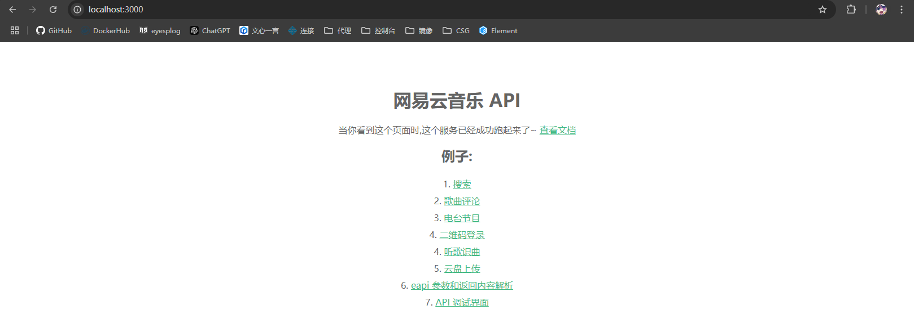

# 部署NeteaseCloudMusicApi

***

- 项目地址：https://www.npmjs.com/package/NeteaseCloudMusicApi?activeTab=readme

`musicatri`项目运行时需要依赖一个可以访问的`neteasecloudmusicapi`应用，后者提供操作网易云音乐接口功能

```bash
# 安装nvm，使用20.18.0版本的node
curl -o- https://raw.githubusercontent.com/nvm-sh/nvm/v0.39.3/install.sh | bash && source ~/.bashrc
nvm install 20.18.0
nvm use 20.18.0

# 通过npx直接运行neteasecloudmusicapi项目
# 为neteasecloudmusicapi创建根目录
mkdir ./neteasecloudmusicapi/ && cd ./neteasecloudmusicapi
# 安装项目依赖
npm install NeteaseCloudMusicApi
# 在3000端口运行neteasecloudmusicapi
npx NeteaseCloudMusicApi@latest

# 你也可以手动指定端口运行，例如指定在4000端口
PORT=4000 npx NeteaseCloudMusicApi@latest
```

```bash
server running @ http://localhost:3000  # 项目运行回显
```

通过 http://localhost:3000 访问NeteaseCloudMusicApi项目，可以点击主页链接参看开发文档

